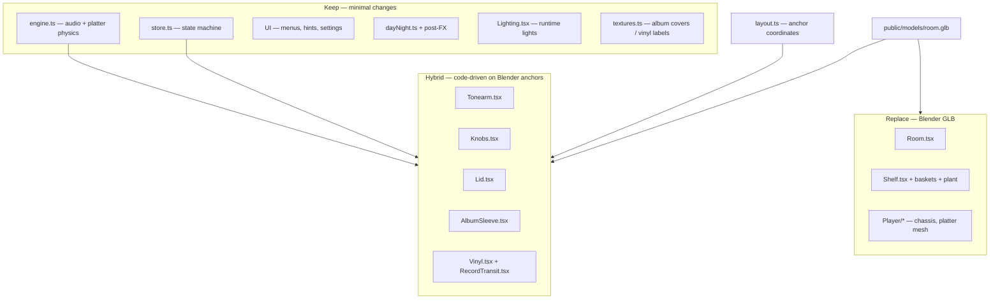

# Blender Scene Migration Plan

Replace the procedurally built 3D room with Blender-authored meshes while keeping the existing app logic (state machine, audio, interactions, atmosphere).

**Goal:** a better-looking static scene from Blender. **Not** a rewrite of the player — the app already animates and interacts in code.

---

## Table of contents

1. [How the app is layered](#1-how-the-app-is-layered)
2. [What you model vs what stays in code](#2-what-you-model-vs-what-stays-in-code)
3. [Reference dimensions (from layout.ts)](#3-reference-dimensions-from-layoutts)
4. [Blender project setup](#4-blender-project-setup)
5. [Naming convention (required)](#5-naming-convention-required)
6. [Modeling checklist by area](#6-modeling-checklist-by-area)
7. [Export settings](#7-export-settings)
8. [Code integration phases](#8-code-integration-phases)
9. [Recalibrating layout.ts](#9-recalibrating-layoutts)
10. [Interaction & click targets](#10-interaction--click-targets)
11. [Testing checklist](#11-testing-checklist)
12. [Common pitfalls](#12-common-pitfalls)
13. [Suggested file structure after migration](#13-suggested-file-structure-after-migration)
14. [Agent brief — copy-paste for Blender rebuild](#14-agent-brief--copy-paste-for-blender-rebuild)
15. [Complete coordinate spec (everything to model)](#15-complete-coordinate-spec-everything-to-model)
16. [Texture & material manifest](#16-texture--material-manifest)

---

## 1. How the app is layered



**Key idea:** Blender supplies beauty meshes. JavaScript still drives anything that moves, responds to the user, or shows per-album artwork.

Animations today are **not** Blender clips. They are `useFrame` loops with `easing.damp` / curves. Your Blender file should be a **static** scene with named empties at pivots.

---

## 2. What you model vs what stays in code

### Model in Blender (static geometry + materials)

| Area | Current code | Notes |
|------|--------------|-------|
| Room shell | `Room.tsx` | Floor, walls, ceiling, skirting, window opening/frame |
| Desk | `Room.tsx` | Top + legs; player sits on it |
| Record player body | `Player.tsx` | Chassis, deck plate, feet |
| Platter mesh | `Platter.tsx` | Visual platter + rubber mat + strobe ring (spindle can be static) |
| Tonearm parts | `Tonearm.tsx` | Tube, headshell, counterweight, bearing base, armrest — parented to pivot empty |
| Lid acrylic | `Lid.tsx` | Transparent lid mesh at hinge empty |
| Knob meshes | `Knobs.tsx` | Power lever, speed knob, volume knob (visual only) |
| Bookcase | `Shelf.tsx` | Side panels, back, shelves, feet, decorative spine row |
| Wicker bins | `BasketShell.tsx` | Shell geometry only |
| Plant | `Shelf.tsx` | Pot + leaves (skip custom SSS shader — plain material is fine) |
| Wall art frame | `WallArt.tsx` | Frame + mat; **or** leave art plane to code (see below) |

### Keep in code (do not bake into Blender)

| Feature | File | Why |
|---------|------|-----|
| Album sleeves | `AlbumSleeve.tsx` + `textures.ts` | Cover art is runtime canvas textures |
| Vinyl disc | `Vinyl.tsx` | Label texture per album |
| Record flight | `RecordTransit.tsx` | Catmull-Rom path + spin on platter |
| Tonearm drag / seek | `Tonearm.tsx` | User-controlled + follows `engine.getProgress()` |
| Knob / switch logic | `Knobs.tsx` | Click, drag, store + engine wiring |
| Lid open/close | `Lid.tsx` | Tied to `recordPhase` |
| Basket slide | `Shelf.tsx` `Basket` | `basketOut` state drives Z position |
| Decorative bin records | `Shelf.tsx` | Procedural filler — optional in Blender |
| Dynamic album count | `Shelf.tsx` | Sleeve slots are data-driven |
| Lights | `Lighting.tsx` | Day/night keyframes in `dayNight.ts` |
| Window glow tint | `Room.tsx` `useFrame` | Emissive driven by `dayPhase` |
| Wall color tint | `Room.tsx` | Same |
| Post-processing | `PostFxEffects.tsx` | Bloom, grain, AO, etc. |
| Volumetrics | `Volumetrics.tsx` | Sun shafts + dust motes |
| Camera fly-to | `CameraRig.tsx` | Positions in `STATIONS` |

### Optional split: wall art

- **Option A (simplest):** Model only the frame in Blender; keep the painting as a textured plane in `WallArt.tsx` (easy to swap images).
- **Option B:** Bake the current painting into the GLB; lose easy image swaps unless you use a material slot the code can retexture later.

---

## 3. Reference dimensions (from layout.ts)

Use **meters**, 1 Blender unit = 1 meter. These are the current canonical sizes — match them on first pass so recalibration is minimal. You can change proportions later, but every change ripples into `layout.ts`.

### Room

| Constant | Value | Meaning |
|----------|-------|---------|
| `ROOM.w` | 6.4 m | Room width (X) |
| `ROOM.d` | 5.0 m | Room depth (Z) |
| `ROOM.h` | 2.9 m | Ceiling height |
| `ROOM.backZ` | -2.2 | Back wall Z position |

### Desk

| Constant | Value |
|----------|-------|
| `DESK.x, DESK.z` | -0.9, -1.72 |
| `DESK.topY` | 0.74 (player sits on this height) |
| `DESK.w × DESK.d` | 1.7 × 0.62 m |

### Record player (group origin = bottom centre of chassis)

| Constant | Value |
|----------|-------|
| `PLAYER_POS` | (-0.9, 0.74, -1.76) world |
| `BODY.w × h × d` | 0.58 × 0.115 × 0.36 m |
| `PLATTER.local` | x: -0.08, z: 0.0 (on deck) |
| `PLATTER.r` | 0.155 m |
| `PLATTER.topLocalY` | ~0.139 m above player origin |
| `VINYL_R` | 0.15 m |
| `VINYL_THICKNESS` | 0.0024 m |
| `VINYL_REST` | World centre when record is on platter (see `layout.ts`) |
| `GROOVE_OUT / GROOVE_IN` | 0.142 / 0.058 m radius from platter centre |
| `ARM.pivotLocal` | (0.205, 0.153, -0.105) |
| `ARM.length` | 0.25 m |
| `ARM.yawRest` | -0.58 rad |

### Shelf (bookcase)

| Constant | Value |
|----------|-------|
| `SHELF.x` | 1.1 |
| `SHELF.wallZ` | -2.2 (flush with back wall) |
| `SHELF.w × d` | 1.33 × 0.36 m |
| `SHELF.sideT` | 0.07 m |
| `SHELF.boardT` | 0.055 m |
| `SHELF.boardY` | 0.4675, 0.8625, 1.2925 (shelf centres) |
| `SHELF.topBoardY` | 1.7225 |
| `SHELF.sideTopY` | 1.75 |
| `SLEEVE.size` | 0.315 m (12" record square) |
| `SLEEVE.thickness` | 0.0145 m |
| `DISPLAY_SLOTS` | 6 (indices 0–5 on top two rows) |
| `SLEEVE_OUT_POS` | (1.09, 1.31, -1.58) inspection pose |
| `BASKET.x` | [0.835, 1.365] (left/right bin centres) |
| `BASKET.outDz` | 0.45 m forward slide when open |

### Wall art

| Constant | Value |
|----------|-------|
| `WALL_ART` | x: -0.9, y: 1.6, z: -2.188, width: 0.96 m |

### Camera stations (retune after visual overhaul)

| View | Position (approx) | Target (approx) |
|------|-------------------|-----------------|
| `overview` | (0.25, 1.36, 1.55) | (0.1, 0.98, -2.0) |
| `player` | (-0.86, 1.46, -0.58) | (-0.9, 0.84, -1.78) |
| `shelf` | (1.1, 1.42, -0.55) | (1.1, 1.24, -2.05) |
| `volume` | (-0.665, 0.875, -1.31) | (-0.665, 0.797, -1.58) |
| `arm` | (-0.86, 1.78, -1.6) | (-0.9, 0.86, -1.78) |
| `art` | (-0.9, 1.6, -0.92) | painting centre |

Full values: `STATIONS` and `PARALLAX` in `src/scene/layout.ts`.

---

## 4. Blender project setup

### Scene settings

1. **Units:** Properties → Scene → Unit System → **Metric**, Unit Scale **1.0**.
2. **Scale:** Model at real-world size (player chassis ~58 cm wide, not 5.8 m).
3. **Forward axis:** glTF uses **+Y up, -Z forward**. Before export: Object → Apply → **All Transforms** on export roots.
4. **Origin:** Use a root empty `SceneRoot` at world origin. Parent the whole room under it.

### Recommended collections

```
SceneRoot
├── Environment          (room, desk, window — static)
├── Shelf                (bookcase mesh — static)
├── Player               (chassis, deck — static)
│   ├── tonearm_pivot    (Empty — rotation driven by code)
│   │   └── tonearm_mesh (arm tube, headshell, etc.)
│   ├── platter_spin     (Empty — Y rotation driven by code)
│   │   └── platter_mesh
│   ├── lid_hinge        (Empty — X rotation driven by code)
│   │   └── lid_mesh
│   ├── knob_volume      (Empty — Z rotation driven by code)
│   ├── knob_speed       (Empty — Z rotation driven by code)
│   └── switch_power     (Empty — X rotation driven by code)
├── basket_L             (Empty — Z slide driven by code)
│   └── basket_L_mesh
├── basket_R
│   └── basket_R_mesh
└── Anchors              (empties only — no mesh)
    ├── sleeve_slot_0 … sleeve_slot_5
    ├── vinyl_rest
    └── player_root
```

### Blocking pass (do this first)

1. Add empties at every anchor listed in [Section 5](#5-naming-convention-required).
2. Drop scaled cubes/planes as placeholders sized from [Section 3](#3-reference-dimensions-from-layoutts).
3. Export a test GLB and load it in the app (Phase 1 below) to verify scale before high-poly modeling.

---

## 5. Naming convention (required)

The code will find objects with `scene.getObjectByName(...)`. Names are **case-sensitive**. Use exact strings.

### Root & player

| Name | Type | Purpose |
|------|------|---------|
| `SceneRoot` | Empty | Optional parent for entire export |
| `player_root` | Empty | World position = `PLAYER_POS`; parent player group here |
| `vinyl_rest` | Empty | World position = centre of record on platter |

### Tonearm (critical — affects seek accuracy)

| Name | Type | Purpose |
|------|------|---------|
| `tonearm_pivot` | Empty | Pivot point; code sets `rotation` order YXZ: pitch (X), yaw (Y) |
| `tonearm_mesh` | Mesh group | Visual arm; child of pivot |
| `arm-base` | Mesh | Click target for arm top-down view (keep this exact name) |
| `arm-pivot-column` | Mesh | Secondary click target (keep exact name) |

Place `tonearm_pivot` so that when pitch = `0.012` and yaw points at the groove, the stylus tip touches the vinyl top surface. See comment in `layout.ts` above `ARM`.

### Platter & lid

| Name | Type | Purpose |
|------|------|---------|
| `platter_spin` | Empty | Y-rotation = `engine.platterAngle` |
| `platter_mesh` | Mesh | Visual platter + mat |
| `spindle` | Mesh | Static — does not spin |
| `lid_hinge` | Empty | Hinge at back edge of lid; X rotation ~0 closed, ~-1.45 open |
| `lid_mesh` | Mesh | Acrylic lid |

### Controls

| Name | Type | Purpose |
|------|------|---------|
| `knob_volume` | Empty | Z rotation from volume 0–1 |
| `knob_speed` | Empty | Z rotation: 33 vs 45 RPM positions |
| `switch_power` | Empty | X rotation: on/off |

### Shelf & bins

| Name | Type | Purpose |
|------|------|---------|
| `sleeve_slot_0` … `sleeve_slot_5` | Empty | Home pose for display albums (world position + rotation) |
| `basket_L` | Empty | Left bin root; slides +Z by `BASKET.outDz` when open |
| `basket_R` | Empty | Right bin root |
| `shelf_backdrop` | Mesh (optional) | Invisible or visible back panel for shelf click-to-unfocus |

Bin album slots (index ≥ 6) use `basketAlbumSlot()` math in code — align bin interiors to match or update that function after modeling.

### Meshes that must NOT be merged

- Tonearm rotating assembly vs bearing base
- Platter spin group vs spindle
- Lid vs chassis
- Each basket vs bookcase
- Knob caps vs player face (separate empties for rotation)

---

## 6. Modeling checklist by area

### Room (`Room.tsx` replacement)

- [ ] Floor plane 6.4 × 5 m at y = 0
- [ ] Back wall at z = -2.2, left/right walls, ceiling
- [ ] Skirting at back wall base
- [ ] Window opening on right wall (~1.35 × 1.05 m, centred near x = 3.2, y = 1.45, z = -0.55)
- [ ] Desk at `DESK` position with top at y = 0.74
- [ ] Materials: wood floor, wall concrete/plaster, desk wood — PBR with roughness maps
- [ ] **Do not** bake day/night wall colors — code tints materials at runtime (or use neutral base colors)

### Player (`Player.tsx`, `Platter.tsx`, parts of `Tonearm.tsx`, `Knobs.tsx`, `Lid.tsx`)

- [ ] Chassis with Braun SK4-ish proportions (`BODY` dims)
- [ ] Deck inset plate on top
- [ ] Four feet
- [ ] Platter centred at `PLATTER.local`, radius 0.155 m
- [ ] Tonearm pivot at `ARM.pivotLocal` relative to `player_root`
- [ ] Arm rest near needle rest position
- [ ] Front-face controls at roughly z = `BODY.d / 2`:
  - Power ~ (0.09, 0.0575, face)
  - Speed ~ (0.155, 0.0575, face)
  - Volume ~ (0.235, 0.0575, face)
- [ ] Lid hinge at back of deck
- [ ] Leave gap for code-spawned vinyl disc at `vinyl_rest`

### Shelf (`Shelf.tsx` replacement)

- [ ] Bookcase at `SHELF.x`, depth into room
- [ ] Three shelf openings + top board at `boardY` / `topBoardY`
- [ ] Six sleeve slot empties on top two rows (3 per row)
- [ ] Middle shelf decorative spines (static mesh OK)
- [ ] Two floor bins at `BASKET.x`
- [ ] Plant beside shelf (optional detail)
- [ ] Interior dark cavity behind spines

### Materials

- [ ] Use glTF-compatible **Principled BSDF** only (maps: Base Color, Normal, Roughness; Metallic where needed)
- [ ] Texture resolution: 1K–2K per material is enough for web
- [ ] Embed textures in GLB for fewer load failures
- [ ] Existing CC0 maps in `public/textures/` can be reused in Blender or replaced

---

## 7. Export settings

**Format:** glTF Binary (`.glb`)

| Setting | Value |
|---------|-------|
| Include | Selected objects **or** entire `SceneRoot` hierarchy |
| Transform | +Y Up |
| Geometry | Apply Modifiers, UVs, Normals |
| Materials | Export materials, embed images |
| Compression | Draco optional (smaller file; test loader first) |
| Animations | **Off** — app handles motion |
| Lights / Cameras | **Off** — app provides both |

**Output path:** `public/models/room.glb` (create `public/models/` if missing)

**Pre-export:**

1. Apply all transforms on mesh objects.
2. Verify normals (no inverted faces on bookcase interior).
3. Run Blender glTF validator or re-import the GLB into a fresh Blender file to sanity-check.

---

## 8. Code integration phases

Work in order. Each phase should compile (`npx tsc --noEmit`) and run in browser before the next.

### Phase 0 — Prep (no behavior change)

- [ ] Create `public/models/` directory
- [ ] Add `src/scene/SceneModel.tsx` — loads GLB with `useGLTF`, exposes named nodes
- [ ] Add dev helper `window.__anchors` — logs world positions of all named empties
- [ ] Optionally mount GLB alongside existing scene (wireframe / 50% opacity) for alignment

### Phase 1 — Static environment only

- [ ] Export room + desk from Blender (no player/shelf yet)
- [ ] Replace floor/walls/desk meshes in `Room.tsx` with `<SceneModel part="environment" />`
- [ ] Keep runtime wall/window tint `useFrame` — retarget material refs by name or traverse
- [ ] Keep `WallArt.tsx` as code-driven plane **or** use Blender frame + code painting
- [ ] Verify: click floor/walls still calls `requestUnfocus()`

### Phase 2 — Player visuals

- [ ] Export player chassis + static parts
- [ ] Replace `Player.tsx` body/deck/feet with GLB meshes
- [ ] Parent existing `Tonearm`, `Platter`, `Knobs`, `Lid` logic to named empties from GLB
- [ ] Hide/remove old procedural meshes in those components; keep interaction handlers
- [ ] Verify: power, speed, volume, lid, tonearm drag, platter spin

### Phase 3 — Shelf & bins

- [ ] Export bookcase + bin shells
- [ ] Replace static shelf geometry in `Shelf.tsx`
- [ ] Parent `Basket` slide groups to `basket_L` / `basket_R`
- [ ] Keep `AlbumSleeve` instances — parent to `sleeve_slot_N` or keep `sleeveSlot()` positions
- [ ] Verify: pull sleeve, flip, place record, bin toggle

### Phase 4 — Calibrate & polish

- [ ] Update `layout.ts` from measured anchor positions (`__anchors` or Blender → export script)
- [ ] Retune `STATIONS` cameras for new composition
- [ ] Add invisible colliders where click targets are too small on detailed mesh
- [ ] Run full flow from `AGENTS.md` verification checklist
- [ ] Remove dead procedural geometry code once stable

### Phase 5 — Cleanup

- [ ] Update `AGENTS.md` architecture map
- [ ] Document final anchor names in this file if they changed
- [ ] Optimize GLB size (merge static materials, texture resize)

---

## 9. Recalibrating layout.ts

After Blender modeling, constants in `src/scene/layout.ts` must match the new empties.

### What to remeasure

| Constant group | Used by |
|----------------|---------|
| `PLAYER_POS`, `BODY`, `PLATTER.*` | Player placement, platter spin |
| `VINYL_REST`, `VINYL_R` | `RecordTransit`, `Vinyl` |
| `ARM.*`, `GROOVE_*`, `yawAtRadius()` | `Tonearm.tsx`, seek accuracy |
| `SHELF.*`, `sleeveSlot()`, `SLEEVE_OUT_*` | `AlbumSleeve.tsx` |
| `BASKET.*`, `basketAlbumSlot()` | Bin albums |
| `STATIONS`, `PARALLAX` | `CameraRig.tsx` |
| `WALL_ART` | `WallArt.tsx` |

### How to measure

**In dev browser** (after Phase 0 helper):

```js
// Example: read world position of an empty
const s = /* R3F scene ref */;
const o = s.getObjectByName('vinyl_rest');
o.updateWorldMatrix(true, false);
o.getWorldPosition(new THREE.Vector3()).toArray();
```

**In Blender:** select empty → Item panel → Location (world if applied to SceneRoot).

### Tonearm calibration (most sensitive)

1. Place record on platter (`recordPhase = 'onPlatter'`).
2. Drop needle manually to outer groove — stylus should touch vinyl surface.
3. If miss: adjust `ARM.pivotLocal`, `ARM.length`, or `PITCH.down` in `Tonearm.tsx`.
4. Verify seek: `__engine.getProgress()` advances and arm follows groove radius.

The pivot height comment in `layout.ts` (lines 33–35) explains the geometry constraint — re-read it if you change platter or vinyl height.

---

## 10. Interaction & click targets

Detailed Blender meshes are bad for raycasting. Patterns already used in the codebase:

| Interaction | Current approach | With Blender |
|-------------|------------------|--------------|
| Tonearm drag | Invisible fat cylinder along arm | Keep invisible helper; disable raycast on high-poly arm mesh (`raycast={null}`) |
| Arm view toggle | Named meshes `arm-base`, `arm-pivot-column` | Keep names on Blender meshes or add collider empties |
| Volume knob | Click mesh + drag | Invisible torus/cylinder collider parented to `knob_volume` |
| Shelf backdrop | Large wall meshes | `shelf_backdrop` mesh or existing board meshes |
| Album sleeves | Box geometry | **Keep code boxes** — dynamic textures |
| Vinyl on platter | Cylinder | **Keep code cylinder** at `vinyl_rest` |

**Rule:** Visual mesh ≠ hit mesh. Either keep named low-poly colliders or set `raycast={() => null}` on decorative GLB meshes and attach handlers to parent groups.

---

## 11. Testing checklist

Run after each phase. Full reload after editing `store.ts` or `engine.ts` (HMR orphans singletons — see `AGENTS.md` pitfall #1).

### Build

- [ ] `npx tsc --noEmit` — clean
- [ ] `npx vite build` — no unexpected errors

### Visual

- [ ] Scene scale feels correct (record player ~58 cm wide)
- [ ] No z-fighting between GLB and code-spawned vinyl/sleeves
- [ ] Shadows cast from GLB meshes (`castShadow` / `receiveShadow` on load)
- [ ] Day/night slider still tints walls/window

### Interaction flow

- [ ] Enter → sound on
- [ ] Click album → sleeve pulls out
- [ ] Flip sleeve (F / drag)
- [ ] Place record → lid opens → record flies to platter
- [ ] Power on → drop needle → progress advances
- [ ] Drag tonearm → seek works
- [ ] Volume view + knob drag + arrow keys
- [ ] Arm top-down view toggle
- [ ] Return record → sleeve goes back
- [ ] Wicker bin toggle + bin album pull
- [ ] Click floor/wall → unfocus views
- [ ] Escape on menus → no stuck focus ring

### Dev helpers

- [ ] `__proj(x,y,z)` click coords still valid after camera retune
- [ ] `__hits(cx,cy)` shows expected targets on controls

---

## 12. Common pitfalls

1. **Wrong scale** — Player 10× too big breaks all of `layout.ts`. Block with dimensioned cubes first.
2. **Merged meshes** — Can't rotate lid/tonearm/bins independently. Keep hierarchy with empties.
3. **Blender animations exported** — Unused weight; may confuse loader. Export static only.
4. **Missing apply transforms** — Skewed colliders and wrong world positions for anchors.
5. **Tonearm pivot wrong** — Needle floats or misses groove; seek feels broken.
6. **Album sleeves in Blender** — Static covers won't update per album. Keep `AlbumSleeve.tsx`.
7. **Replacing lights with Blender lights** — Day/night won't work. Keep `Lighting.tsx`.
8. **Expecting Blender render look in browser** — Atmosphere is post-FX + `dayNight.ts`; tune those separately.
9. **Draco compression** — If enabled, ensure `useGLTF` / decoder path works in Vite.
10. **Conditional hooks** — Don't put `useGLTF` behind short-circuit hooks; blank screen with no error.

---

## 13. Suggested file structure after migration

```
public/
  models/
    room.glb              # Main scene export
    room_test.glb           # Optional blockout for alignment

src/scene/
  SceneModel.tsx            # useGLTF loader + node lookup
  anchors.ts                # Optional: names → typed refs
  layout.ts                 # Updated coordinates (still source of truth)
  Room.tsx                  # Thin wrapper: environment + click handlers
  Player/
    Player.tsx              # GLB chassis + mounts interactives
    Tonearm.tsx             # Logic only; visuals from GLB
    Platter.tsx             # Spin empty + optional mat mesh
    Knobs.tsx               # Logic + colliders
    Lid.tsx                 # Hinge empty
  Shelf/
    Shelf.tsx               # GLB shelf + AlbumSleeve list + baskets
    AlbumSleeve.tsx         # Unchanged logic, dynamic textures
    Vinyl.tsx               # Unchanged
  RecordTransit.tsx         # Unchanged path animation
  Experience.tsx            # Add SceneModel in Suspense
```

---

## 14. Agent brief — copy-paste for Blender rebuild

Use this section as the prompt/spec for a Blender modeling agent. Everything below is derived from the live codebase (`src/scene/layout.ts`, `Room.tsx`, `Player/*`, `Shelf/*`, `WallArt.tsx`, `textures.ts`).

### Mission

Rebuild the **static 3D environment** for a Dieter Rams–inspired record-listening room as a **glTF Binary (`.glb`)** file. Match the coordinates and materials in [Section 15](#15-complete-coordinate-spec-everything-to-model) and [Section 16](#16-texture--material-manifest).

The web app will load your GLB and **drive all motion in code** (tonearm drag, platter spin, sleeve pull-out, bin slide, lid open). Your file is a **posed static scene** with **named empties at every pivot/slot**.

### Coordinate system

| Rule | Value |
|------|-------|
| Up axis | **+Y** |
| Forward (toward camera in overview) | **+Z** |
| Units | **Meters** (1 Blender unit = 1 m) |
| World origin | Floor centre; back wall at **z = -2.2** |
| Record scale reference | 12″ sleeve = **0.315 m** square |

### Deliverable

- One file: `room.glb` (or split `room.glb` + `player.glb` if easier — document split)
- All transforms **applied** before export
- **Principled BSDF** materials only; embed texture images
- **No animations** exported
- **No lights or cameras** (app provides both)
- Every empty in [Section 5](#5-naming-convention-required) placed at the coordinates in [Section 15](#15-complete-coordinate-spec-everything-to-model)

### Model these (static meshes)

1. Room — floor, walls, ceiling, skirting, window opening/glass plane
2. Desk — top + four legs
3. Record player — Braun SK4-style chassis, deck, feet, platter, rubber mat, spindle, tonearm geometry, armrest, front controls, acrylic lid
4. Bookcase — walnut shelves, sides, back, feet, middle-shelf decorative spines
5. Two wicker pull-out bins (open-top shells)
6. Potted plant beside shelf
7. Wall-art frame + mat (painting image optional — see textures)

### Do NOT model (app handles at runtime)

- Album sleeves (dynamic cover art per album)
- Vinyl disc on platter (dynamic label texture)
- Invisible click colliders
- Lights, bloom, dust, sun shafts
- Day/night color shifts on walls (use neutral base colors; app tints)

### Hierarchy requirement

Movable parts must be **separate objects** parented to **named empties** (see Section 5). Never merge tonearm, lid, platter spin group, or bins into one mesh.

### Quality bar

- Dieter Rams / Braun aesthetic: clean geometry, soft bevels, restrained palette
- PBR materials with supplied texture maps where listed
- Real-world scale — player chassis ~**58 cm** wide, room ~**6.4 × 5 m**
- Leave clearance at `vinyl_rest` empty for a 30 cm disc (radius 0.15 m)

---

## 15. Complete coordinate spec (everything to model)

All positions are **world space** unless marked *player-local* (relative to `player_root` at `PLAYER_POS`).

**Constants used throughout:**

```
PLAYER_POS     = (-0.9,  0.74, -1.76)
ROOM.backZ     = -2.2
SHELF.x        =  1.1
SHELF.zMid     = -2.02   (= wallZ + d/2)
SHELF_FRONT_Z  = -1.84
SHELF_BACK_INNER_Z = -2.17
```

---

### 15.1 Room shell

| Object | Shape | Centre position (x, y, z) | Size / rotation | Material notes |
|--------|-------|----------------------------|-----------------|----------------|
| `floor` | Plane, XZ | (0, 0, 0) | **6.4 × 5 m** | Oak planks — see `floor_wood` texture; roughness 0.7 |
| `wall_back` | Plane, XY | (0, **1.45**, **-2.2**) | **6.4 × 2.9 m** | Microcement maps; base tint `#ece9e2`; normal scale 0.3 |
| `wall_left` | Plane | (**-3.2**, 1.45, 0) | **7 × 2.9 m**, rot Y **+90°** | Flat paint `#ece9e2`, roughness 0.95 |
| `wall_right` | Plane | (**3.2**, 1.45, 0) | **7 × 2.9 m**, rot Y **-90°** | Same as left |
| `ceiling` | Plane, XZ | (0, **2.9**, 0) | **6.4 × 7 m** | `#efece6`; slight emissive (app drives at runtime) |
| `window_glass` | Plane | (**3.188**, **1.45**, **-0.55**) | **1.35 × 1.05 m**, rot Y **-90°** | Warm emissive `#ffb040` — app drives intensity |
| `skirting` | Box | (0, **0.045**, **-2.192**) | **6.4 × 0.09 × 0.014 m** | `#e2dfd8`, roughness 0.8 |

Window sits in the **right wall** (positive X), afternoon sun direction.

---

### 15.2 Desk

Group origin at **(DESK.x, 0, DESK.z) = (-0.9, 0, -1.72)**.

| Object | Centre (local → world) | Size | Material |
|--------|------------------------|------|----------|
| `desk_top` | (0, **0.715**, 0) → **(-0.9, 0.715, -1.72)** | **1.7 × 0.05 × 0.62 m** | Oak — `desk_wood` texture; roughness 0.55 |
| `desk_leg` ×4 | (±**0.78**, **0.345**, ±**0.24**) | cylinder r=**0.016**, h=**0.69 m** | `#9a9a98`, metalness 0.8, roughness 0.35 |

Leg positions: `x = ±(DESK.w/2 - 0.07)`, `z = ±(DESK.d/2 - 0.07)`, `y = (DESK.topY - 0.05) / 2`.

Desk top surface is at **y = 0.74** — player sits flush on this height.

---

### 15.3 Record player

**`player_root` empty at world (-0.9, 0.74, -1.76).**  
All following positions are *player-local* unless noted.

#### Chassis

| Object | Local position | Size | Material |
|--------|---------------|------|----------|
| `player_chassis` | (0, **0.0575**, 0) centre | **0.58 × 0.115 × 0.36 m** rounded box, bevel r≈**0.007** | `#f4f2ed`, metalness 0.15, roughness 0.45 |
| `player_deck` | (0, **0.1156**, 0) | **0.56 × 0.0012 × 0.34 m** | `#eceae5`, metalness 0.3, roughness 0.35 |
| `player_foot` ×4 | (±**0.25**, **-0.008**, ±**0.14**) | cylinder top r=**0.014**, bot r=**0.016**, h=**0.016** | `#2c2c2e`, roughness 0.7 |

#### Platter (parent spin group to `platter_spin`)

| Object | Local position (relative to platter group) | Size | Material |
|--------|---------------------------------------------|------|----------|
| `platter_spin` empty | (**-0.08**, **0.115**, **0**) | — | Y-axis spin driven by code |
| `platter_mesh` | y = **0.012** | cylinder r=**0.155**, h=**0.024**, slight taper | `#c9c7c2`, metalness 0.75, roughness 0.3 |
| `platter_mat` | y = **0.0251** | cylinder r=**0.150**, h=**0.0022** | `#1c1c1e`, roughness 0.92 |
| `platter_strobe` | y = **0.008** | thin rim ring r≈**0.155** | `#8e8c88`, metalness 0.6 |
| `spindle` | y = **0.030**, **static** (not child of spin) | cylinder r=**0.0035**, h=**0.014** | `#b8b6b2`, metalness 0.9 |

**Groove band** (invisible reference — do not model grooves; code uses radii from platter centre at local xz **(-0.08, 0)**):

| Groove | Radius from platter centre |
|--------|---------------------------|
| Outer (start of record) | **0.142 m** |
| Inner (end of record) | **0.058 m** |
| Vinyl disc (code-spawned) | **0.15 m** |

**`vinyl_rest` empty — world position (-0.98, 0.883, -1.76)**  
Centre of record when seated on mat. Leave **≥ 0.15 m** clearance radius above deck.

#### Tonearm (parent rotating assembly to `tonearm_pivot`)

| Object | Local position | Size / notes | Material |
|--------|---------------|--------------|----------|
| `tonearm_pivot` empty | (**0.205**, **0.153**, **-0.105**) | Rotation order **YXZ**: pitch X, yaw Y | — |
| `arm-base` mesh | y = **-0.017** (child of pivot) | cylinder r **0.018→0.022**, h **0.044** | `#b9b7b3`, metalness 0.85 — **keep exact name** |
| `arm-pivot-column` mesh | y = **0.011** | cylinder r=**0.007**, h=**0.026** | `#c9c7c3` — **keep exact name** |
| `tonearm_mesh` (rotating group) | child of pivot | | |
| Arm tube | pos (0, 0.012, **0.115**), rot X 90° | cylinder r=**0.0042**, len **0.23** | `#d6d4d0`, metalness 0.9 |
| Headshell | (0, 0.006, **0.238**) | box **0.016 × 0.013 × 0.034** | `#2a2a2c` |
| Stylus | (0, **-0.0035**, **0.246**) | cone r=**0.0018**, h=**0.006** | `#888` — must touch vinyl at pitch down |
| Counterweight | (0, 0.012, **-0.04**) | cylinder r=**0.013**, h=**0.024** | `#3a3a3c` |
| `armrest_post` | world ≈ **(-0.832, 0.881, -1.656)** | post h=**0.045**, cradle box **0.012 × 0.005 × 0.018** | `#9a9894` |

Arm length = **0.25 m** from pivot to stylus. Rest yaw ≈ **-0.58 rad** (-33°).

#### Front controls (player-local)

Front face at **z = +0.18** (half of BODY.d). Control row height **y = 0.0575**.

| Empty / object | Local (x, y, z) | World (x, y, z) | Notes |
|----------------|-----------------|-----------------|-------|
| `switch_power` | (0.09, 0.0575, 0.18) | **(-0.81, 0.798, -1.58)** | Lever box 0.022×0.034; rot X ±0.55 on toggle |
| `knob_speed` | (0.155, 0.0575, 0.18) | **(-0.745, 0.798, -1.58)** | Cylinder r=**0.0155**, h=**0.014**; rot Z 33/45 |
| `knob_volume` | (0.235, 0.0575, 0.18) | **(-0.665, 0.798, -1.58)** | Cylinder r=**0.024**, h=**0.018**; rot Z from volume |

Speed knob indicator dots at local (±0.0095, 0.021, 0) — grey and orange `#e0552c`.

#### Lid (parent to `lid_hinge`)

| Object | Local | Size | Material |
|--------|-------|------|----------|
| `lid_hinge` empty | (0, **0.116**, **-0.174**) | Rot X: 0 closed, **-1.45 rad** open | — |
| `lid_mesh` | offset (0, **0.0525**, **0.174**) from hinge | **0.565 × 0.105 × 0.348 m** | Acrylic: `#dfe4e6`, opacity **0.16**, roughness 0.08, transmission-like |

---

### 15.4 Bookcase (walnut)

Centre line **x = 1.1**. Depth spans **z = -2.2** (back) to **z = -1.84** (front).

| Object | Centre (x, y, z) | Size | Material |
|--------|------------------|------|----------|
| `shelf_side_L` | (**0.47**, **0.905**, **-2.02**) | **0.07 × 1.69 × 0.36 m** | Walnut vertical grain |
| `shelf_side_R` | (**1.73**, 0.905, -2.02) | same | Walnut vertical grain |
| `shelf_back` | (1.1, 0.905, **-2.179**) | **1.19 × 1.69 × 0.018 m** | Walnut vertical grain |
| `shelf_board_0` | (1.1, **0.4675**, -2.02) | **1.19 × 0.055 × 0.35 m** | Walnut horizontal grain |
| `shelf_board_1` | (1.1, **0.8625**, -2.02) | same | horizontal |
| `shelf_board_2` | (1.1, **1.2925**, -2.02) | same | horizontal |
| `shelf_top` | (1.1, **1.7225**, -2.02) | same | horizontal |
| `shelf_foot` ×4 | corners under side panels | **0.055 × 0.06 × 0.055 m** | `#211a14` |

Side panel centre y = `footH + sideH/2` = **0.06 + 1.69/2 = 0.905**.  
Side x = `SHELF.x ± (w/2 - sideT/2)` = **0.47 / 1.73** (centre of each side panel).

#### Sleeve slot empties (for code-spawned albums — **no sleeve meshes**)

Lean back **0.13 rad** against back panel. Rotation: **Y = -90°** (-π/2), **X lean = -0.13** on pose group.

| Empty | World position (x, y, z) | Row |
|-------|--------------------------|-----|
| `sleeve_slot_0` | (**0.703**, **1.477**, **-2.142**) | Top (row 0, col 0) |
| `sleeve_slot_1` | (**1.1**, **1.477**, **-2.142**) | Top col 1 |
| `sleeve_slot_2` | (**1.497**, **1.477**, **-2.142**) | Top col 2 |
| `sleeve_slot_3` | (**0.703**, **1.047**, **-2.142**) | Middle (row 1) |
| `sleeve_slot_4` | (**1.1**, **1.047**, **-2.142**) | Middle col 1 |
| `sleeve_slot_5` | (**1.497**, **1.047**, **-2.142**) | Middle col 2 |

Sleeve box size (for clearance, not modeled): **0.0145 × 0.315 × 0.315 m** (thin × square).

Inspection pose when pulled out (reference): **(1.09, 1.31, -1.58)**, rot Y **-90°**.

#### Decorative spine row (middle shelf — static meshes OK)

- Base shelf top: **y = 0.495** (`boardY[0] + boardT/2`)
- ~40–60 thin boxes packed along x from **0.517** to **1.683**
- Each spine: width **0.009–0.020 m**, height **0.275–0.303 m**, depth **0.30 m**
- z ≈ **-2.02** (slightly forward of back panel)
- Colors from palette in [Section 16.3](#163-color-palette-no-texture)

#### Plant

| Object | World position | Size | Material |
|--------|---------------|------|----------|
| `plant_pot` | (**0.65**, **1.785**, **-2.01**) | cylinder r **0.035→0.045**, h **0.07** | `#e8e5df` |
| `plant_leaf` ×5 | stacked on pot | cones h **0.19–0.27**, r≈**0.016** | `#4a6b4f`, roughness 0.7 |

---

### 15.5 Wicker bins

Open-top woven boxes. **`BASKET.showLids = false`** in app — no lids unless you choose lidded variant.

| Object | Rest position (x, y, z) | Size | Slide |
|--------|-------------------------|------|-------|
| `basket_L` empty | (**0.835**, 0, **-1.95**) | shell **0.48 × 0.29 × 0.32 m** | +**0.45 m** on **+Z** when open |
| `basket_R` empty | (**1.365**, 0, **-1.95**) | same | same |

Shell wall thickness ≈ **0.02 m**. Interior filler colour `#3a2c1e`.  
Front handle cutout: centre (**0**, **0.174**, **0.172**) local to bin, size **0.10 × 0.03 × 0.006**.

Decorative records inside bins (optional static meshes): **0.30 × 0.315 × 0.012 m** boxes, spaced **0.035 m** along bin depth from front.

Bin album home y ≈ **0.2425** (`SLEEVE.size/2 + 0.085`).

---

### 15.6 Wall art

| Object | World centre | Size | Material |
|--------|-------------|------|----------|
| `wall_art_frame` | (**-0.9**, **1.6**, **-2.188**) | See below | Frame wood `#3d362e` |
| Mat board | same, z +0.001 | inset | `#ebe7e0` |
| Painting plane | same, z +0.0035 | **0.96 m wide** × **0.783 m tall** (aspect 1200:979) | Image: `art/de-hooch-musical-company.jpg` |

Frame outer size: art + **0.05 m** pad each side → **1.06 × 0.883 m**. Frame depth **0.02 m**.

Optional second art asset exists at `public/art/vermeer-guitar-player.jpg` — not currently mounted in scene.

---

### 15.7 Reference-only (do not model — code paths)

Record flight curve (`RecordTransit.tsx`) — vinyl travels between sleeve out pose and `vinyl_rest`:

| Point | World (x, y, z) |
|-------|-----------------|
| Start | (1.09, 1.31, -1.58) |
| Via 1 | (0.82, 1.40, -1.42) |
| Via 2 | (-0.15, 1.18, -1.52) |
| Via 3 | (-0.97, 1.01, -1.745) |
| End | (-0.98, 0.883, -1.76) |

Camera stations (for composition reference — app uses these, do not export cameras):

| View | Eye (x,y,z) | Target (x,y,z) |
|------|-------------|----------------|
| overview | (0.25, 1.36, 1.55) | (0.1, 0.98, -2.0) |
| player | (-0.86, 1.46, -0.58) | (-0.9, 0.84, -1.78) |
| shelf | (1.1, 1.42, -0.55) | (1.1, 1.24, -2.05) |
| volume | (-0.665, 0.875, -1.31) | (-0.665, 0.797, -1.58) |
| arm | (-0.86, 1.78, -1.6) | (-0.9, 0.86, -1.78) |
| art | (-0.9, 1.6, -0.92) | (-0.9, 1.6, -2.188) |

---

## 16. Texture & material manifest

All file paths are relative to `public/` in the repo. Copy these into your Blender project or reference them by absolute path when building.

### 16.1 Image textures on disk

| ID | Files | Used on | Source / license |
|----|-------|---------|------------------|
| `wall_concrete` | `textures/wall_diff.jpg` (sRGB)<br>`textures/wall_nor.png`<br>`textures/wall_rough.jpg` | Back wall only | Poliigon "Concrete Worn" (8690) — project-licensed. Cropped 2.2:1 band, brightness-normalized. UV: **one full map spans entire 6.4×2.9 m wall**, no repeat |
| `walnut` | `textures/walnut_diff.jpg` (sRGB)<br>`textures/walnut_nor.jpg`<br>`textures/walnut_rough.jpg` | Bookcase | CC0 — [Poly Haven Dark Wood](https://polyhaven.com/a/dark_wood) 2K |
| `wicker` | `textures/wicker_diff.jpg` (sRGB)<br>`textures/wicker_nor.jpg`<br>`textures/wicker_rough.jpg` | Bin shells | CC0 — [ambientCG Wicker007A](https://ambientcg.com/a/Wicker007A) 1K |

**Walnut UV notes (from code):**

- **Horizontal grain** (shelf boards): map as-is
- **Vertical grain** (sides, back): rotate diffuse + roughness **90°** in UV/material; **no normal map** on vertical faces (rotated normals break lighting)

**Wicker UV notes:**

- Repeat ≈ **2.2 × 1.3** across bin surfaces (~2.5 cm strand scale)

**Wall normal scale:** 0.3 in app — keep subtle in Blender.

### 16.2 Procedural / solid-color materials (no image file)

These are generated in code today. In Blender, use solid Principled BSDF or bake similar procedurals.

| ID | Applied to | Base color | Other params |
|----|-----------|------------|--------------|
| `floor_wood` | Floor plane | Procedural oak: base `#d9bf9c` (light) with grain streaks | UV repeat **5 × 5 m**; roughness **0.7**. *Alternative:* use `walnut` maps at larger repeat |
| `desk_wood` | Desk top | Procedural oak: base `#c9aa7c` | UV repeat **2 × 1 m**; roughness **0.55** |
| `wall_paint_side` | Left/right walls | `#ece9e2` | Roughness 0.95; app tints at runtime — model neutral |
| `wall_paint_back_tint` | Back wall multiply | `#ece9e2` × concrete map | Roughness 1.0 |
| `ceiling_plaster` | Ceiling | `#efece6` | Emissive `#b8b4ac` intensity ~0.55 (app-driven) |
| `window_glow` | Window plane | `#fff8f0` | Emissive `#ffb040` intensity ~1.65 (app-driven) |
| `skirting` | Skirting board | `#e2dfd8` | Roughness 0.8 |
| `desk_leg_metal` | Desk legs | `#9a9a98` | Metalness 0.8, roughness 0.35 |
| `player_chassis` | Player body | `#f4f2ed` | Metalness 0.15, roughness 0.45 |
| `player_deck` | Deck plate | `#eceae5` | Metalness 0.3, roughness 0.35 |
| `player_foot` | Feet | `#2c2c2e` | Roughness 0.7 |
| `platter_metal` | Platter | `#c9c7c2` | Metalness 0.75, roughness 0.3 |
| `platter_mat` | Rubber mat | `#1c1c1e` | Roughness 0.92 |
| `platter_strobe` | Rim dots | `#8e8c88` | Metalness 0.6, roughness 0.5 |
| `spindle` | Spindle | `#b8b6b2` | Metalness 0.9, roughness 0.2 |
| `arm_metal` | Tonearm tube | `#d6d4d0` | Metalness 0.9, roughness 0.2 |
| `arm_base` | Bearing | `#b9b7b3` / `#c9c7c3` | Metalness 0.85, roughness 0.25 |
| `headshell` | Headshell | `#2a2a2c` | Roughness 0.5 |
| `stylus` | Stylus | `#888888` | Metalness 0.7, roughness 0.3 |
| `counterweight` | Counterweight | `#3a3a3c` | Metalness 0.8, roughness 0.35 |
| `armrest` | Armrest | `#9a9894` | Metalness 0.7, roughness 0.4 |
| `knob_alu` | Knobs | `#dad8d4` | Metalness 0.85, roughness 0.3 |
| `knob_indicator` | Speed dots | `#5a5a5c` / `#e0552c` | — |
| `switch_body` | Power housing | `#bdbbb7` | Metalness 0.6, roughness 0.4 |
| `switch_lever_on` | Power lever active | `#e0552c` | Roughness 0.45 |
| `switch_lever_off` | Power lever off | `#2e2e30` | Roughness 0.45 |
| `lid_acrylic` | Lid | `#dfe4e6` | **Alpha 0.16**, roughness 0.08, non-metallic |
| `lid_highlight` | Lid top edge | `#ffffff` | Alpha 0.35 |
| `shelf_foot` | Shelf feet | `#211a14` | Roughness 0.6 |
| `bin_interior` | Bin cavity | `#3a2c1e` | Roughness 1.0 |
| `bin_handle` | Handle recess | `#241a12` | Roughness 1.0 |
| `plant_pot` | Pot | `#e8e5df` | Roughness 0.8 |
| `plant_leaf` | Leaves | `#4a6b4f` | Roughness 0.7; subsurface optional |
| `frame_wood` | Art frame | `#3d362e` | Roughness 0.84, metalness 0.03 |
| `frame_mat` | Art mat | `#ebe7e0` | Roughness 0.96 |
| `sleeve_edge` | *(code only)* | `#dedad2` | Roughness 0.9 — for reference |
| `vinyl_groove` | *(code only)* | `#0b0b0c` + groove rings | Vinyl stays in app |

### 16.3 Color palette (no texture)

Decorative record spines (middle shelf + inside bins) — pick from:

```
#8a8074  #6b5d4f  #3e3a36  #a39482  #5c6470  #7d6b5a
#494540  #94867a  #665d52  #8f7f6e  #3a4350  #7a4a3a
#b0a390  #55503f  #274a43  #8c3b2e
```

Roughness **0.75** for all spines.

### 16.4 Runtime-only textures (do NOT bake into GLB)

The app generates these per album at runtime — leave empty space at sleeve slots and vinyl_rest.

| Texture | Generator | Resolution | Notes |
|---------|-----------|------------|-------|
| Sleeve front | `sleeveTextures()` | 1024² | Album cover image |
| Sleeve back | `sleeveTextures()` | 1024² | Track list on `#e9e5dd` |
| Sleeve spine | `sleeveTextures()` | 96×1024 | Accent color + rotated text |
| Vinyl label | `vinylTopTexture()` | 1024² | Grooves + centre label from cover |

### 16.5 Art assets

| File | Used | Dimensions | Mount |
|------|------|------------|-------|
| `public/art/de-hooch-musical-company.jpg` | **Yes** — above player | 1200×979 px | Landscape, 0.96 m wide |
| `public/art/vermeer-guitar-player.jpg` | Not mounted | — | Spare |

### 16.6 Texture file checklist for Blender agent

Copy or link these **10 files** into your Blender project:

```
public/textures/wall_diff.jpg
public/textures/wall_nor.png
public/textures/wall_rough.jpg
public/textures/walnut_diff.jpg
public/textures/walnut_nor.jpg
public/textures/walnut_rough.jpg
public/textures/wicker_diff.jpg
public/textures/wicker_nor.jpg
public/textures/wicker_rough.jpg
public/art/de-hooch-musical-company.jpg
```

Credits: see `public/textures/CREDITS.md`.

### 16.7 Export material rules

- Use **glTF 2.0 Principled BSDF** only (maps: Base Color, Normal, Roughness, Metallic)
- Embed images in GLB
- Keep base wall/ceiling colors **neutral** — the app multiplies/tints them for day/night
- Acrylic lid: alpha blend; may need app-side material override if export looks wrong
- Target texture resolution **1K–2K** per material for web performance

---

## Keeping coordinates in sync

`src/scene/layout.ts` is the source of truth. After editing it or Section 15 of this doc, run:

```bash
npm run verify-blender-plan          # fail if the plan doc drifts
node scripts/verify-blender-plan.mjs # dump full JSON to stdout
node scripts/verify-blender-plan.mjs --write  # write scripts/blender-coordinates.json
```

Feed `scripts/blender-coordinates.json` to a Blender agent for machine-readable anchors.

---

## Quick start (minimum viable path)

If you want the shortest path to seeing Blender art in the app:

1. Block out room + player + shelf with cubes using [Section 3](#3-reference-dimensions-from-layoutts) dimensions.
2. Add all empties from [Section 5](#5-naming-convention-required).
3. Export to `public/models/room.glb`.
4. Ask for `SceneModel.tsx` scaffold + Phase 1 integration in the repo.
5. Iterate on Blender detail while the blockout proves alignment.
6. Recalibrate `layout.ts` once proportions are final.

---

*Last updated: matches codebase as of the Blender migration planning pass. Update this file when anchor names or integration phases change.*
